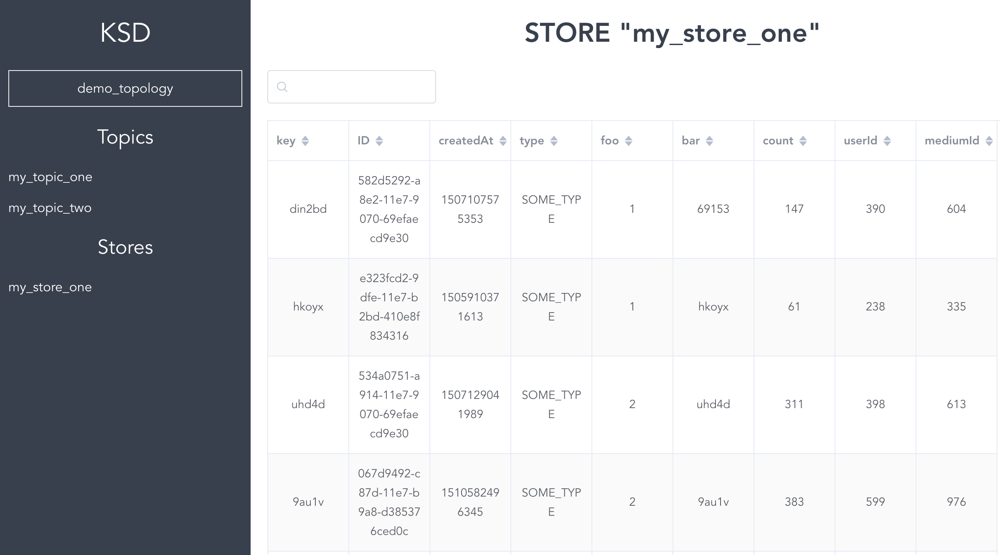

# KSD
_KSD offers a debug UI for Kafka Streams_

## Import
Add the repository :
```
<repositories>
    <repository>
        <id>jitpack.io</id>
        <url>https://jitpack.io</url>
    </repository>
</repositories>
```

Add to your _pom.xml_
```
<dependency>
    <groupId>com.rocel</groupId>
    <artifactId>ksd</artifactId>
    <version>0.1.0</version>
</dependency>
```

## Features
 - List all topics used in the topology
 - Show information about a selected topic
 - List all stores used in the topology
 - Show all the data of specified store
 - Search in the data of a specified store 

## Screenshots

#### Show all the data of a specified store :

